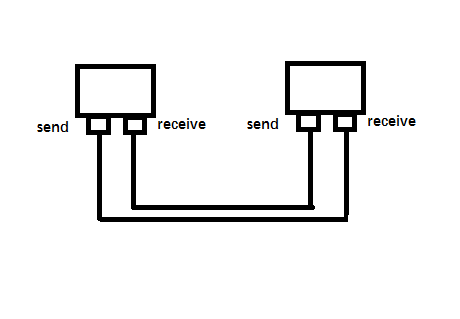
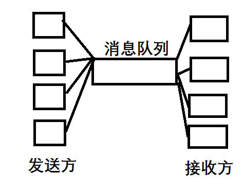

[snake] 贪吃蛇
## 介绍
###### 这个贪吃蛇是version 1.3版本，功能有基本的蛇、食物和墙的交互、以及多条蛇之间的交互（蛇吃食物以后会通知其他的蛇），设计模式采用的是常见的mvc模式和观察者模式
## 技术关键
1. 采用的是b/s模式的socket通信，大致的图如下

每个客户端都有一个发送端和接收端，发送端发送消息，接收端接受消息。
这里的通信方式需要修改，因为每个客户端充当一个服务器，这样客户端的压力比较大，在version 1.4版本采用的是rabbitmq消息队列缓存消息，减少客户端的消息压力。

2. 界面采用的是原声javafx和canvas写的，两套可以随时切换,但是java在界面方面的性能并不是很好，所以在version 1.5版本，采用html当成界面。
3. 采用观察者模式，在多蛇交互中，需要互相通知其他的用户自己的状态，于是引用了观察者模式。
4. 采用mvc模式，作用是将逻辑代码与普通java实体类和界面相互分离，使得代码的耦合性降低了。
